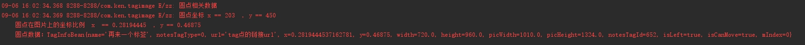

# TagImageView
高仿小红书标签添加功能 
   <ol>
	<li>随点击处添加标签</li>
	<li>计算标签位置</li>
	<li>可将标签位置还原渲染至不同屏幕尺寸</li>
	<li>拖拽删除标签</li>
	<li>可拖拽时支持点击标签更换文字方向</li>
	<li>不可拖拽时支持点击标签响应点击事件</li>
   </ol>

未做的：
当标签贴边，文字框将会收缩。

* 效果图

* Log

## Bean

    private String name;                  //标签内容

    private int notesTagType;             //标签type
  
    private String url;                   //标签url

    private double x;                     //圆心x的在父控件位置 %

    private double y;                     //圆心y的在父控件位置 %

    private float width;                  //控件宽度

    private float height;                 //控件高度

    private float picWidth;               //图片的宽度

    private float picHeight;              //图片的高度

    private int notesTagId;               //标签id

    private boolean isLeft = true;        //圆点是否在左边

    private boolean isCanMove = true;     //标签是否可以移动

    private int index;                    //用来记录在编辑标签中的index 位置